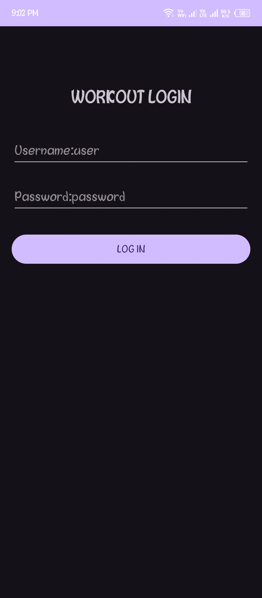
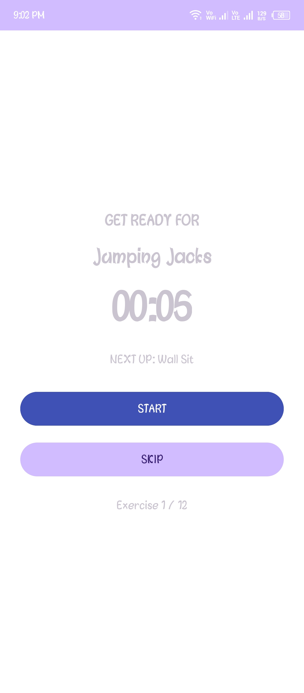

# 7-Minute Workout App 💪

A fully functional Android application for 7-minute workout plans. The app integrates multiple features including user authentication, API data fetching, offline storage, notes management, and SQLite database persistence. It is built using Java and XML in Android Studio.

## 🚀 Key Features
- User authentication system (login, registration, and password reset)
- Landing screen with navigation to different modules
- Fetch workout data from a public API and display using RecyclerView
- Offline storage of API data using SQLite database
- Notes feature with add and delete functionality
- Persistent local storage using SQLite
- Responsive and clean UI design
- Error handling with offline fallback support
- Smooth navigation between screens using Intents
- 7-minute workout routine with 12 exercises
- Timer with pause, resume, and skip options

## 🛠️ Tech Stack
- Java  
- XML (UI Design)  
- Android Studio  
- SQLite Database  
- REST API Integration  

## 📱 Description
This application provides a simple and efficient 7-minute workout experience while demonstrating Android development concepts like authentication, API integration, local storage, and multi-screen navigation.

## 📸 Screenshots

### Home Screen

### Login Screen

### Notes Feature

### Workout Screen

## 👨‍💻 Developer
GULL-max
